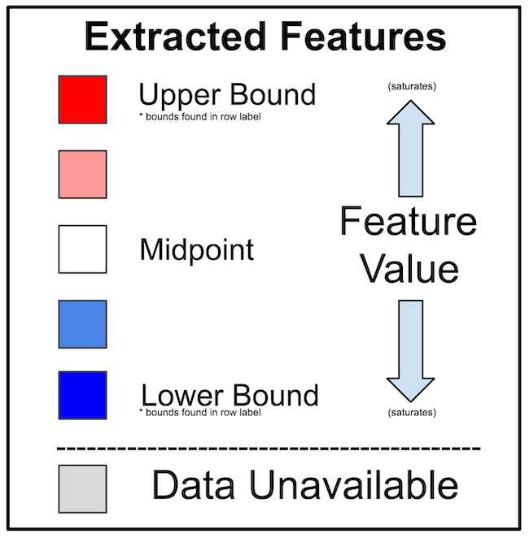

# process_audio_diary
Code for quality control and feature extraction/visualization from phone audio diaries, including workflow for automated push/pull with TranscribeMe and sanity check of resulting transcripts.   

Information about the steps of the pipeline, including expected inputs/outputs, can be found below. Any additional questions should be directed to mennis@g.harvard.edu.

The current version of this repository matches what is used internally for Baker Lab audio diary data. It is in the process of being generalized for wider release. This is a prerelease, made publicly viewable for the purposes of testing on collaborator machines.

### Table of Contents
1. [Setup](#setup)
2. [Primary Pipeline](#pipeline)
	- [Architecture Diagram](#diagram)
	- [Audio Processing Details](#audio)
	- [Transcript Processing Details](#transcript)
	- [Visualization Generation Details](#viz)
3. [Testing To Date](#test)
	- [Runtime Information](#time)
4. [Remaining TODOs](#todo)

### Setup 
All necessary Python (3.9) dependencies can be found in the setup/audio_process.yml file in this repo. As long as you have Anaconda installed, you can easily create a Python enviornment for running this code by moving to the setup folder and running:

	conda env create -f audio_process.yml

To activate the environment, which should be done each time before running the code, use:
	
	conda activate audio_process

Note that before the first time running on a new machine, it may be necessary to start Python (in the activated conda environment) and enter the following two commands, in order for the NLP features script to work:

	import nltk
	nltk.download('cmudict')

Similarly, a handful of the required packages are not conda installable, so that before the first the run the following should be entered on the command line (in the activated conda environment):

	pip install soundfile
	pip install librosa
	pip install vaderSentiment
	pip install wordcloud

It will also be necessary to install the lab encryption model for a first run, if the raw files need to be decrypted. To do so, enter the following command after activating the environment:

	pip install cryptease
	
Other dependencies are OpenSMILE (2.3.0) and ffmpeg (4.3.2), as well as the ability to run bash scripts and a working mail command - the latter two should be available on any standard Linux server. 

### Primary Pipeline 
The two scripts "phone_audio_preprocess.sh" and "phone_transcript_preprocess.sh" in the top level of this repository are for running the full phone audio preprocessing and full phone transcript preprocessing workflows. There is now also a third top-level script, "phone_diary_viz.sh", which is intended to be run periodically to generate visualizations of the outputs created by the audio and transcript processing scripts. Currently the weekly pipeline runs need to be queued manually, as they require entering sensitive password information.

Under the individual_modules subfolder are bash scripts called by these three primary scripts, which can also be used directly to perform individual steps of the pipeline on an input study as needed. For example, if the pipeline gets interrupted in the middle of a run, the modules can be used to complete the preprocessing of that batch without needing to restart the entire pipeline (everything besides email generation is currently robust to interruptions). The modules can also be used to rerun only a subset of the preprocessing steps if a major change is made and need to be updated in legacy data - such as addition of new QC features. The python scripts called by the modules are in the individual_modules/functions_called subfolder, although there should be no need for the user to run these directly. If the code needs to be run only on particular patients, the wrapping bash script modules can be edited to use a whitelist or blacklist of OLIDs when looping over a study. 

##### Architecture Diagram 
 

##### Audio Processing Details 
To initiate the audio side of the pipeline, navigate to the repository folder and run:

	bash phone_audio_preprocess.sh

The script will then prompt for study name and decryption password. It will also ask if the user wants audio to be automatically uploaded to TranscribeMe, and if so will further prompt for the TranscribeMe account password, and minimum length/volume requirements for audio to send. Additioanlly, the user can set a limit on the total number of minutes of audio that will be uploaded to TranscribeMe. If the processed amount exceeds this "budget", no files will be uploaded and the decrypted files will instead be left as they would in the case of no automatic transcription. Logging from the script is both printed to the console and (for now) saved in the file "audio.log" newly created for each run under the folder from which the pipeline was called. A summary of the processed files is also emailed when transcript upload is enabled. To get an email alert without transcription, enable automatic upload with the maximum number of minutes set to 0.

	
The audio side of the pipeline completes the following core tasks for each patient in the study:

* Creates metadata CSV that maps to each study day a single recording file (if any), and the submission time info in ET. This occurs via calling phone_audio_metadata_format.py helper. Look for ETFileMap output in each patient's phone/processed/audio folder. Note that submission time is coded as an integer between 4 and 27, because any submission prior to 4 am Eastern Time will be considered a night time submission counted towards the previous day. 
* Decrypts all audio diaries under phone/raw/\*/audio_recordings that have not yet been analyzed (determined by checking for an OpenSMILE output for that file). It uses the crypt_exp helper so that the study password entered at the beginning can be used for every audio file that needs to be decrypted. Decrypted files are then converted to WAV format, and kept in a temporary folder for each patient located at phone/processed/audio/decrypted_files
* Updates the audio QC output CSV to include stats for all of the currently decrypted audio files. This occurs via calling phone_audio_qc.py helper, and the audioQC output can again be found in the patient's phone/processed/audio folder. The primary features computed are:
	* Length of audio (in minutes)
	* Overall volume (in dB)
	* Standard deviation of amplitude (related to variance of volume)
	* Mean of spectral flatness computed by librosa
	* Max of spectral flatness computed by librosa
	* There is also a check that the file is mono (expected for the diaries)
* Runs voice activity detection on all the currently decrypted files, generating a temporary foreground audio file which is subsequently used for pause detection. A list of all pause times across a given patient's processed diaries can be found in the [study]\_[OLID]\_phone\_audioVAD\_pauseTimesOutput.csv file on the top level of the phone/processed/audio folder for that patient. These pause times are then used to generate additional QC metrics for each diary (saved to [study]\_[OLID]\_phone\_audioVAD\_pauseDerivedQC_output.csv in the same folder), and to filter OpenSMILE results by NaNing out all rows of the OpenSMILE output that map to a bin wholly contained in one of the identified pause periods. The new OpenSMILE outputs are saved in the opensmile_features_filtered subfolder of phone/processed/audio, with each individual file now named using study day number convention: [study]\_[OLID]\_phone\_audioSpeechOnly\_OpenSMILE\_day[cur_day].csv, with cur_day formatted to 4 digits. The phone_audio_vad.py script executes all of this processing through the three functions diary_vad, diary_pause_detect, and diary_pause_qc. While pause detection was validated via close manual review on a test set, the utility of the pause-derived QC measures remains to be seen. These include:
	* Total minutes marked as speech
	* Total number of pauses
	* The average pause length in seconds
	* The maximum pause length in seconds
	* The decibel level during pause times
	* The mean spectral flatness during pause times
	* There are also three spectrogram images generated by the VAD scripts - a figure comparing the original, foreground, and background audios, as well as a figure showing only the portions selected as speech and a figure showing only the portions marked as pauses. All 3 images for each diary can be found under the vad_spectrogram_comparisons subfolder of phone/processed/audio.
* Merges the current ETFileMap CSV with the current audioQC and pauseDerivedQC output CSVs, adding some additional metadata columns in the process. This is done to prepare and save a new up to date DPDash formatted CSV. The phone_diary_dpdash_compile.py helper is utilized here. For BLS and DPBPD we have already set up DPDash to display these CSVs as they are updated.
* Computes OpenSMILE features for all currently decrypted audio files, using GeMAPS lld config. One feature CSV for each audio file will be saved, in the opensmile_feature_extraction subfolder of phone/processed/audio. Note the naming of the OpenSMILE outputs will reflect the raw Biewe audio name rather than the processed naming convention using study day. Further steps of OpenSMILE summary will eventually lead to feature CSVs with the expected names (not yet implemented). 
* Identifies audio files that are acceptable to be sent for transcription, moving them to the phone/processed/audio/to_send folder. Files are considered acceptable if they are the first audio diary submmitted for a particular day, and they are above a certain requisite length and volume threshold. When auto transcribe is off, the length and volume thresholds will be automatically set to 0, so that all files (provided they were the first submitted for their day) will be moved to the to_send subfolder. When it is on, the thresholds are a user setting. This portion of the script utilizes the phone_audio_send_prep.py helper. 
* Then if auto transcribe is on, the audio files in the to_send folder will actually be uploaded to TranscribeMe, using the phone_transcribeme_sftp_push.py helper. As the files are succesfully uploaded, they are moved to the phone/processed/audio/pending_audio folder on PHOENIX. This script as well as the audio identification script also utilize targeted renaming of the audio files with coded prefixes, to help in constructing the email alert in the next step.  
* If auto transcribe is on, the script will next generate the bodies of the email alerts via the phone_audio_email_write.py helper. One email will be generated to be sent to lab members (currently myself, Justin, and Einat), and one email will be generated to be sent to TranscribeMe sales and tech support addresses (as well as myself). The email to the lab includes information on each file processed and the outcome (sent for transcription vs upload failed vs rejected), while the email to TranscribeMe simply summarizes how many total files were successfully uploaded, and how many minutes they sum to. Before the script is over it will revert any tracking-related name changes made to the audio files. 
* At the end of the pipeline, the decrypted_files folder will be deleted to remove the rejected decrypted audios along with the foreground audios. Any empty to_send folders will also be deleted. If files remain in some of the to_send folders when auto transcription is on, an additional warning will be printed to check for failed TranscribeMe uploads. When auto transription is off, it is the expected behavior to have to check the to_send folder manually for each OLID at the end of the run. The pending_audio subfolders will be later used by the transcription side of the pipeline.  

	
The standalone bash modules in individual_modules corresponding to each of the above steps are:

* run_metadata_generation.sh
* run_new_audio_decryption.sh
* run_audio_qc.sh
* run_vad.sh
* run_dpdash_format.sh
* run_opensmile.sh
* run_audio_selection.sh
* run_transcription_push.sh

There is also a run_email_writer.sh module called by the main pipeline, but that script is not suitable to be run separately as the rest are.

##### Transcript Processing Details 
To initiate the transcript side of the pipeline, navigate to the repository folder and run:

	bash phone_transcript_preprocess.sh

The script will then prompt for study name and TranscribeMe account password. It expects that the audio side pipeline has been run with auto transcription on recently, and new transcripts are now returned by TranscribeMe - if there are no new transcripts available to pull it will recognize this and exit. If the later steps of the pipeline need to be run on older transcripts or other transcripts sent outside the scope of the automatic push code, individual modules used in the pipeline can be called separately as needed. Logging from the main script is both printed to the console and (for now) saved in the file "transcript.log" newly created for each run under the folder from which the pipeline was called. A summary of the new transcripts is also emailed. 

	
The transcript side of the pipeline completes the following core tasks for each patient in the study:

* Checks the TranscribeMe server for new txt files available matching the expected processed study day naming convention corresponding to the audio file names in pending_audio. It then pulls any of these transcripts that it can, placing them in the phone/processed/audio/transcripts subfolder. Upon succesful pull the script will delete the raw decrypted audio from both the TranscribeMe server and the pending_audio folder on PHOENIX, as well as moving the transcript txt file to the appropriate study archive subfolder on the TranscribeMe server. It utilizies the phone_transcribeme_sftp_pull.py helper.
* Converts any new transcripts found under phone/processed/audio/transcripts to a CSV, placing it in the csv subfolder of that folder. 
* Runs QC on all existing phone diary transcripts, resulting in a newly updated transcript QC output CSV found in the patient's phone/processed/audio folder.  This occurs via calling the phone_transcript_qc.py helper. The primary features computed are: 
	* The number of subjects (different speakers identified by TranscribeMe, for this should usually be 1)
	* The number of sentences and the number of words, as well as the minimum and maximum number of words found in a sentence
	* The number of occurences of [inaudible] and [redacted] markers, as well as questionable transcriptions where the word is surrounded by a question mark and brackets to denote the transcriber's uncertainty
	* Counts of both non-verbal (uh/um) and verbal (like/you know/I mean) edits
	* Counts of repeated utterances (when words or word fragments occur multiple times in a row)
	* Counts of sentence restarts (via use of -- by TranscribeMe)
	* The number of commas and the number of dashes appearing in the transcript (factors related to disfluencies per our manual transcript review)
	* The final timestamp that occurs in the transcript (will be at the start of the last sentence)
	* The smallest and largest number of seconds that occurs between two sentence timestamps in this transcript
	* The smallest and largest number of seconds that occurs between two sentence timestamps in this transcript, when weighted by the number of words in the intervening sentence. The smallest absolute value is also included as occasionally a negative time is found between timestamps
	* The number of sentences spoken by subject 1 (which should be the vast majority of the sentences even if there were additional subjects identified)
* Merges the current DPDash-formatted audio QC CSV with the current transcriptQC output CSV and adds some additional metadata columns, to prepare and save a new up to date DPDash formatted CSV for the transcript QC. The phone_diary_dpdash_compile.py helper is utilized here, as the same script performs both the audio QC formatting and then the transcript QC formatting where applicable. For BLS and DPBPD we have already set up DPDash to display these CSVs as they are updated.
* Computes NLP features for each transcript and then summarizes them for the patient, using phone_transcript_nlp.py with the help of language_feature_functions.py. Enhanced transcript CSVs with sentence-level feature columns are saved under a new subfolder of the patient's transcript folder called "csv_with_features", and a file called "[study]\_[OLID]\_phone\_transcript\_NLPFeaturesSummary.csv" is saved in the top level of the patient's phone/processed/audio folder. Sentence-level features are summarized via mean, standard deviation, min, and max, and include:
	* Coherence and word uncommonness scores using Google Wav2Vec
	* Sentiment scores from the VADER package
	* Number of syllables and associated speech rate (syllables/second) using the NLTK package and TranscribeMe's provided timestamps
	* Counts of any specified keywords
* Compiles and sends an email to the lab (again currently just myself, Justin, and Einat) with information on which pending transcripts were succesfully pulled and processed, and which were not yet available from TranscribeMe. It will also include information on any errors encountered during processing that will require some manual intervention. 

	
The standalone bash modules in individual_modules corresponding to each of the above steps are:

* run_transcription_pull.sh
* run_transcript_csv_conversion.sh
* run_transcript_qc.sh
* run_dpdash_format.sh
* run_transcript_nlp.sh

The email for this side of the pipeline is simpler logic than the audio/push side, and so is just built into the main pipeline bash script instead of warranting its own module. 

##### Visualization Generation Details 
To create all pipeline-related visualizations, navigate to the repository folder and run:
	
	bash phone_diary_viz.sh

The script will then prompt for study name. Details on each type of visualization generated follow. All visualization code draws from functions defined in viz_helper_functions.py under the functions_called subfolder. Logging from the main script is both printed to the console and (for now) saved in the file "viz.log" newly created for each run under the folder from which the pipeline was called.

	
Distributions:

The pipeline calls run_distribution_plots.sh to generate study-wide distributions of audio and transcript QC features, creating for each patient and for the overall study a PDF with histograms for each feature. The study-wide outputs can be found under /data/sbdp/Distributions/phone/voiceRecording, while the per patient outputs are added to the top level of the phone/processed/audio folder for that patient. phone_audio_per_patient_distributions.py and phone_transcript_per_patient_distributions.py are the scripts called by run_distribution_plots to take a particular patient's QC features and update the study-wide distribution with any new values, as well as creating the patient-specific PDF. phone_diary_total_distributions.py is then called to create PDFs for both audio and transcript features from the study distribution, and to generate a pared down distribution CSV containing only key features, combined across modalities. Another histogram PDF is generated from this, and it is also used to create a basic summary CSV giving a few high level stats per participant. The latter is saved under "[study]-phoneDiarySummary-perOLID.csv" in that same distributions folder, and can be used to quickly assess which patients are submitting diaries of good quality at a regular rate.   

In addition to setting up the respective QC distributions, the transcript-side script puts together another set of distributions from the NLP feature outputs described above, while the audio-side script does the same for OpenSMILE results. On the audio side the script will first generate a summary CSV for the patient with mean and standard deviation of all OpenSMILE features per diary saved to the file "[study]\_[OLID]\_phone\_audio\_OpenSMILEFeaturesSummary.csv" in the top level of the patient's phone/processed/audio folder, and then use this to proceed as with the other datatypes. Also specific to OpenSMILE, the code will create a PDF of 10 ms bin based feature distributions for each individual audio diary, found under a new subfolder in the folder containing the OpenSMILE results, called per_diary_distribution_plots.

Note that all OpenSMILE-related distribution and visualization generation is done on both the raw OpenSMILE results and the results filtered to contain only speech times. The later uses the same naming conventions but with "FilteredOpenSMILE" in the place of "OpenSMILE". 

Histogram bin settings are currently hard-coded for each feature of interest.  

  

	
Heatmaps:

The pipeline calls run_heatmap_plots.sh to create updated heatmaps for each patient showing the progression of select audio and transcript QC features over diaries (rows are features and columns are days). It loops through patients in the input study, calling phone_diary_qc_heatmaps.py to generate a heatmap for each patient that has existing audio QC output. The heatmap will also include transcript QC features where available. To improve readability, a new heatmap will be generated for every 13 weeks of the study. Heatmaps can be found for a given patient in the heatmaps subfolder of their phone/processed/audio folder. The audio features found in the heatmap are length, amplitude, flatness, number of pauses, and speech length, while the transcript features are number of sentences and words, number of inaudibles, questionables, and redacteds, and min timestamp distance between sentences weighted by the number of words in the sentence. Heatmaps are currently colored using hard-coded absolute bounds. A legend for interpreting these heatmaps is below.

	
WordClouds:

The pipeline calls run_wordclouds.sh to create frequency-based wordclouds for each available transcript. It loops through patients in the input study, calling phone_transcript_wordclouds.py for each patient. That script will use VADER sentiment along with the python wordcloud package to generate a sentiment-colored wordcloud for each transcript CSV available for that patient, if such a wordcloud does not already exist. The wordclouds can be found in a subfolder of phone/processed/audio called wordclouds.

	
Correlation Matrices:

The pipeline calls a python function, phone_diary_correlations.py, to generate study-wide correlation matrices. As this only occurs on the study-level and not on the patient-level, there is no wrapping bash script for it. This python script uses helper functions defined in correlation_functions.py.

For each of the study-wide distributions generated by the distribution module, a Pearson correlation matrix (pairwise correlatin within each CSV) is computed. Each matrix figure is saved in the same folder as the distributions, visualized with a purple-white-green colormap (where the darkest green is a correlation of 1.0, the darkest purple is a correlation of -1.0, and white is a correlation of 0.0). For the key features distribution, the features are also clustered and a dendrogram image is saved. A second correlation matrix with the summary features ordered based on prior cluster results (currently hard-coded) is also saved.

### Testing To Date 
The audio preprocess pipeline sans auto transcription has been tested on DPBPD, completed on all raw diaries submitted on 3/28/2021 or earlier. For BLS, the full audio and transcription pipelines were run weekly for a one month pilot test, with audio preprocess and TranscribeMe push occuring on Mondays, and TranscribeMe pull and transcript preprocess occuring on Fridays. This began on 3/29/2021, covering the prior week of audio diaries, and ran through 4/30/2021. Based on our review of the caluclated QC features and some manual checking of audio files/transcripts, we used loose cutoffs of length at least 5 seconds and volume at least 20 db for this initial run. Based on deeper review of those results by Claire Foley, we are planning to use a 30 db amplitude cutoff but no length cutoff for future use. Diaries from 5/2021 and later for BLS have yet to be processed. Any older diaries from BLS however have at least had the audio preprocess scripts completed, and a subset of them were also previously transcribed - so the transcription processing steps have been run on those as well. Example results can be seen in the Baker Lab BLS Dropbox PUSH folder. 

A final internal testing round for the code on incoming BLS diaries in late 10/2021 is planned.

##### Runtime Information 
As features have been added over the course of development, we are waiting on completion of our final internal testing round to report exact runtime estimates. However, initial notes are provided below.  

	
Runtime details from early testing:

Based on our pilot run of the code in 4/2021, expected runtime for the audio side of the full pipeline is about 30 seconds per minute of audio diary to be processed, plus a couple minutes of constant overhead. The transcript side of the pipeline runs much faster, with previous transcript processing tests taking approximately one third of the time spent on audio processing for the same batch. During pilot testing the audio side consistently finished in less than 15 minutes, and the transcript side in under 5. TranscribeMe turnaround time was also very good, with transcription always finishing by mid-week. Therefore there were no issues with the Monday/Friday code schedule. 

As Voice Activity Detection (VAD) has now been added, the expected runtime of the audio side of the pipeline will increase substantially, likely more than doubling. Pause detection adds only a second or so per minute of audio, but the initial step of extracting foreground from the audio can take nearly one minute per minute of audio, and the final step of deriving QC metrics from pause times is over 15 seconds per minute of audio. These times were estimated from calculating VAD on the BLS audio backlog, but more exact runtimes will be reported when the final pre-release version of the code is tested on new BLS diaries in the coming weeks.  

On the transcript side, runtimes have similarly not yet been adjusted to account for newly added NLP features. These have slow overhead with loading the word2vec model, but improving efficiency is on the TODO list. Once completed the code is expected to take slightly longer than reported above, which will also be verified as part of the final round of internal testing. 

Visualization runtime was checked across the full set of almost 10,000 BLS audio diaries with over 1000 corresponding transcripts. Distribution generation was able to complete in under 5 minutes, and heatmap generation in under 10. The distribution script and parts of the heatmap script will be rerun on all data every time (heatmap runtime should be at least halfed in subsequent runs though). The wordclouds on the other hand were much slower, only getting through \~7 transcripts each minute - however, wordclouds are only generated once for a given transcript, so for a typical weekly pipeline run this should take less than 10 minutes. Thus the entire pipeline should take up less than an hour of compute time across the whole week for a typical study, although of course this may vary with the number of study participants and their consistency in submitting diaries. 

The per-diary OpenSMILE histogram creation remains to be tested - while it may be somewhat slow to run, it should be similar to the wordclouds in that these only need to be generated once, and shouldn't be prohibitive on a weekly timescale. Final study-wide correlation matrix generation also remains to be thoroughly tested - this will of course be rerun everytime, but if speed is prohibitive it need not be updated on a regular basis, as it could be pulled out to a more optional/low frequency module. 

### Remaining TODOs 
The highest priority among next steps for this repo will be those steps required to release a basic version of this pipeline to other groups involved in the U24.

The larger TODOs that are part of this project are described in much more detail on our AV Workflowy here: https://workflowy.com/#/0d161a698231

The priority TODOs (for this and other AV projects) can be found under the frequently updated "Next Meeting Agenda" bullet. 

In particular, the following sub-bullet describes the list of steps required for MVP release: https://workflowy.com/#/e8c01d402608
