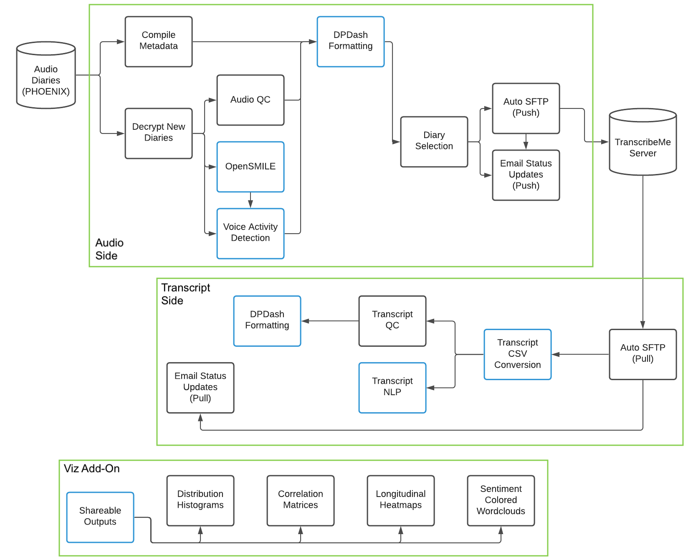

# process_audio_diary

This pipeline serves to facilitate data management and processing of daily participant app-based audio journal recordings for digital psychiatry research, a promising up and coming datatype. The code is currently an internal Baker Lab tool, made openly available for use by collaborators and more general reference by the broader research community. Still, keep in mind it was written as infrastructure for a single research group.

In particular, my code handles quality control and feature extraction/visualization from phone audio diaries collected via Beiwe, including a workflow for automated push/pull with TranscribeMe and sanity check of resulting transcripts. In this process it handles a number of file organization tasks, including logistics for preserving patient privacy such as encrypting the most sensitive outputs and removing info like real dates from those outputs marked as deidentified. It also provides additional tools to assist in data flow and QC monitoring, most notably a system for email alerts that can notify lab members whenever new audio files are processed or new transcripts are returned by TranscribeMe. 

Extracted features for downstream analyses produced by the code include labeled pause times, estimated speaking rate, OpenSMILE-derived low level acoustic descriptors for voiced portions, VADER sentence sentiment, Google News word2vec-based measures of semantic incoherence, counts for different categories of linguistic disfluencies, and basic word usage rate info. These features are discussed at length from both a psychiatric and technical perspective in chapter 1 of [my thesis](https://menace.live/thesis). There I also provide example visualization outputs from the pipeline, including distribution histograms, longitudinal heatmaps, voice spectrograms, correlation matrices, and sentiment-colored word clouds.

Notably, I review properties of many of these features in closer detail for the lab's Bipolar Longitudinal Study in [my thesis](https://menace.live/thesis), with over 10000 high quality journal recordings collected to date. The pilot analyses there support a number of arguments about the utility of audio diaries and their under-appreciation in digital psychiatry to date. Additionally, they provide valuable information for planning of journal collection and analysis in future works.

The README here of course focuses on software documentation, for use and future extensions of this code base. At present, the code is written to run across Baker Lab studies, and this is intended to be a final release version internally -- but it is not necessarily immediately usable by other groups. A major purpose of this documentation then is to assist with adaptations of the pipeline as needed down the road.

- Michaela Ennis (5/2023)

### Table of Contents
1. [Installation](#setup)
	- [TranscribeMe Setup](#transcribeme)
	- [Lochness and DPDash](#lochness)
2. [Use](#pipeline)
	- [Input File Expectations](#inputs)
	- [Storage Considerations](#storage)
	- [Runtime Information](#time)
3. [Audio Processing Details](#audio)
	- [Step by Step Audio Module Descriptions](#modaud)
4. [Transcript Processing Details](#transcript)
	- [Step by Step Transcript Module Descriptions](#modtrans)
5. [Visualization Generation Details](#viz)
	- [Step by Step Visualization Module Descriptions](#modviz)
6. [Future Work (Adapting the Code)](#todo)
	- [Longer Term Improvements](#todol)

### Installation 

Initial installation of the code should be straightforward and is described here. Note we run this code on a standard compute node of the Partners Healthcare ERIS cluster, so it does not have any special hardware requirements - one of the intentions of the design. It does not use a GPU and easily runs on a machine with just a single CPU and 4 GB of RAM.

Most necessary Python (3.9) dependencies can be found in the setup/audio_process.yml file in this repository. As long as you have Anaconda installed, you can easily create a Python environment for running this code by moving to the setup folder and running:

	conda env create -f audio_process.yml

To activate the environment, which should be done each time before running the code, use:

	conda activate audio_process

	
Note that before the first time running on a new machine, there are a few other steps to take to finalize setup of the python environment, as follows:

It may be necessary to start Python (in the activated conda environment) and enter the following two commands, in order for the NLP features script to work:

	import nltk
	nltk.download('cmudict')

Similarly, a handful of the required packages are not conda installable, so that before the first the run the following should be entered on the command line (in the activated conda environment):

	pip install soundfile
	pip install librosa
	pip install vaderSentiment
	pip install wordcloud

It will also be necessary to install the lab encryption model for a first run, if the raw files need to be decrypted. To do so, enter the following command after activating the environment:

	pip install cryptease	

Finally, it is necessary for the NLP features as implemented to download the publicly available Google News 300 dimensional word2vec model, and ensure the path to that model is updated in the code to reflect the path on your machine (look for /data/sbdp/NLP_models/GoogleNews-vectors-negative300.bin in the current code).

Other dependencies are OpenSMILE (2.3.0) and ffmpeg (4.3.2), as well as the ability to run bash scripts and a working mail command - the latter two should be available on any standard Linux server. 

For both OpenSMILE and ffmpeg it will be important to ensure the path to their executables are part of your PATH environment variable before running the code. To setup this sort of initialization to occur automatically upon server login for regular pipeline runs, look into editing your \emph{.bashrc} file in your home directory. Regardless, for OpenSMILE the path to the default config files downloaded into your installation location will need to be updated directly in this code base - to the GeMAPS config for full compatibility with the current pipeline. Look for /data/sbdp/opensmile/opensmile-2.3.0/config/gemaps/GeMAPSv01a.conf in this repo to find path locations to update. 

##### TranscribeMe Setup 

Note that the use of TranscribeMe is also functionally a dependency for the entire transcript side of the pipeline at this time, though the audio features can still be extracted regardless. To set up the pipeline to work with TranscribeMe, you must first contact them to ask for an account on their SFTP server like is used for the Baker Lab and the AMPSCZ project. For full functionality, you should request the same transcription quality and notation settings used by the Baker Lab, as well as basic txt output format with audio-matching file names, no headers in the text body, and ASCII encoding. From there no further "installation" work is required, and the same TranscribeMe account can be used for multiple lab studies as desired. 

As far as transcription settings, the pipeline currently expects use of TranscribeMe's full verbatim transcription service for its uploaded diaries with sentence-level timestamps, which is a manually done human (professional) service. Produced transcripts are HIPAA-compliant with personally identifying information (PII) removed. We use the "AI learning team" of transcribers to ensure a maximal level of care is taken in transcription accuracy. A TranscribeMe rep can assist in matching our lab's protocol for future projects. For more details on the exact output conventions expected from TranscribeMe, please refer to [the thesis PDF](https://menace.live/thesis). One might also refer to [TranscribeMe's (English) style guide](https://www.dropbox.com/s/lo19xzux3n16pbn/TranscribeMeFullVerbatimStyleGuide.pdf?dl=0).

##### Lochness and DPDash 

Optionally, the [Lochness](https://github.com/harvard-nrg/lochness) and [DPDash](https://github.com/dptools/dpdash) open source tools used by the Baker Lab can be integrated with the pipeline to further facilitate operations. Lochness will pull audio diaries from Beiwe to the compute server and enforce the expected input folder structure and naming conventions automatically once set up. On the other end, the QC summary CSV output by the pipeline is formatted for compatibility with DPDash, so if that is set up the outputs of the pipeline can be easily monitored via the online GUI with automatic updates. Using these tools in conjunction with the current pipeline is highly recommended, especially Lochness.

If you are coming from AMPSCZ, please note that the version of Lochness used by the Baker Lab has a number of important distinctions from that used by AMPSCZ, and of particular note is that the designed folder hierarchy under PHOENIX is fairly different for the two projects. For this code to work without an overhaul to expected folder structure, it will require the Baker Lab version (described in more detail below), *not* the structure used by AMPSCZ. More generally, please do not confuse this pipeline with that for basic data flow/quality control of submitted MindLAMP journals across AMPSCZ, which is an entirely separate project and code base with largely different goals.

### Use 
The two scripts "phone_audio_preprocess.sh" and "phone_transcript_preprocess.sh" in the top level of this repository are for running the full phone audio preprocessing and full phone transcript preprocessing workflows. There is now also a third top-level script, "phone_diary_viz.sh", which is intended to be run periodically to generate visualizations of the outputs created by the audio and transcript processing scripts. Currently the weekly pipeline runs need to be queued manually in the Baker Lab, as they require entering sensitive password information.

To initiate the audio side of the pipeline, navigate to the repository folder and run:

	bash phone_audio_preprocess.sh

To initiate the transcript side of the pipeline, navigate to the repository folder and run:

	bash phone_transcript_preprocess.sh

To create all pipeline-related visualizations, navigate to the repository folder and run:
	
	bash phone_diary_viz.sh

Under the individual_modules subfolder are bash scripts called by these three primary scripts, which can also be used directly to perform individual steps of the pipeline on an input study as needed. For example, if the pipeline gets interrupted in the middle of a run, the modules can be used to complete the preprocessing of that batch without needing to restart the entire pipeline (everything besides email generation is currently robust to interruptions). The modules can also be used to rerun only a subset of the preprocessing steps if a major change is made and need to be updated in legacy data - such as addition of new QC features. The python scripts called by the modules are in the individual_modules/functions_called subfolder, although there should be no need for the user to run these directly. If the code needs to be run only on particular patients, the wrapping bash script modules can be edited to use a whitelist or blacklist of patient IDs when looping over a study.

	
Click here for a visual overview of data flow and the use of different modules through the pipeline.

 

##### Input File Expectations 

The code as a whole expects a particular set of data organization and naming conventions to be met for raw data -- conventions that will be satisfied by default if using Lochness to pull the journal recordings from Beiwe. If running the code in a more bespoke manner, it will be necessary to either replicate the expected input structure or edit the code. For convenience, input expectations are specified here. 

The root path for the main Baker Lab storage is currently hard coded, but could be very easily changed across the scripts, from /data/sbdp/PHOENIX to any other desired root folder. However, the file organization from there (especially the nested PHOENIX folder structure) will be more difficult to change in the code, so that should be avoided if possible. 

	
The expectations for the nested folder structure and the raw upload file names are as follows:

* Under the root data structure there must be two folders, GENERAL and PROTECTED. It is expected that GENERAL will contain deidentified data while PROTECTED will contain sensitive identifiable information. 
* Under both GENERAL and PROTECTED will be the top level folders for each study. For example, BLS is one of our study folders. When running the pipeline, the study to process audio journal data for will be a prompted argument, but obviously if the study folder is not set up properly it will not be able to run.
* Under the study folder will be folders for each subject ID enrolled in that study. 
	* For the GENERAL side study folder, there also must be a csv file named "study"\_metadata.csv (i.e. BLS\_metadata.csv in our case). That csv needs to map subject IDs to their consent dates. If using Lochness to pull the raw data from e.g. Beiwe, this will already be set up (as should the entire folder structure). 
* Subject ID folders must then contain folders for each major data source that is being collected from that participant. For data being pulled from Beiwe, this should be called "phone" (and is what the pipeline here expects).
* Under data source folders comes the "raw" and "processed" folders. The input data should of course be found under raw, and outputs of the pipeline will go under processed. As audio journal recordings are a sensitive datatype, this all occurs under PROTECTED for the current code. 
	* For the code to be run by a particular account, either a folder named "audio" will need to already exist under all of the relevant PROTECTED side processed folders (and be accessible/writable by the current account), or the processed folders themselves would need to be writable by the current account to create "audio". 
	* The phone folders under each raw folder will need to be accessible for the code to run as well, but the code does not need write permissions to any part of raw. It is recommended that the code not be able to make changes in raw -- while there is no reason it should modify or delete anything there, it is best for data safety reasons to minimize these permissions for the purest form of the data. 
* For processing the raw audio diaries, the code assumes there will be mp4 files pulled from Beiwe by Lochness and encrypted with cryptease. 
	* The convention for Beiwe folder structure is that under a given raw folder there will be one subfolder (with unique ID) for each device the participant has (or had) Beiwe registered on. The pipeline will automatically go through and check for/process new diaries from any registered device.
	* Under each device folder, there will be subfolders for different datatypes Beiwe provides. In the pipeline's case, the relevant folder name is "audio\_recordings".
	* For audio diaries, Beiwe allows multiple different prompts to be administered to a participant in parallel. As such, there are folders under audio\_recordings that each correspond to a unique prompt ID. Under those folders are where the (encrypted) .mp4.lock files are found. 
		* Per the current Beiwe to Lochness protocol, these are not necessarily shared across subjects or even devices, regardless of if a prompt is the same on the study design end. Because of that, the pipeline presently treats these folders just as it treats the phone ID folders -- tracked in the highest level metadata, but other than that entirely ignored. The pipeline will search through all of the available prompt ID folders for possible new journal submissions. 
		* Note that the code right now enforces a 1 diary per study per subject ID convention, so if multiple submissions are made in one day (whether under the same prompt or not), only the first chronologically is counted towards that study day.
	* The raw audio file names themselves are expected to follow Beiwe convention for providing metadata, i.e. "YYYY-MM-DD hh\_mm\_ss" followed either directly by the file extension, or sometimes a "+00" or other two digit code after a plus sign and then the file extension.
		* Note that this time provided by Beiwe is always in the UTC timezone per our protocol. The pipeline thus assumes this is UTC, and for our purposes converts to ET. 

To summarize, the code will look for new input diaries at the following file paths:

	[root]/PROTECTED/[study]/[subjectID]/phone/raw/*/audio_recordings/*/YYYY-MM-DD hh_mm_ss.mp4.lock

Where \[root\] is an easy to change path throughout the code that currently corresponds to /data/sbdp/PHOENIX, \[study\] is the name of the study prompted by the main pipeline upon launch, \[subjectID\] is all IDs with audio journal data and a properly registered consent date under the input study (will of course be carefully tracked throughout), \* are wildcards that will match any folder name (as they correspond to random Beiwe-generated IDs), and finally the file name contains date and time information as presented and is an mp4 encrypted by cryptease. 

Similarly, all outputs created by the pipeline can be found under folders at paths of the following form:

	[root]/PROTECTED/[study]/[subjectID]/phone/processed/audio

##### Storage Considerations 

As individual audio journals are quite short, they do not generally require much careful consideration about storage relative to related datatypes like interview recordings. However, file sizes can add up, and pipeline intermediates may require a small (but > 1) multiplier on raw data storage, so it is worth a quick thought whether extra disk space might need to be looked into before getting too deep in a study.

	
An estimate of required storage is as follows:

A rough estimate for raw audio-only MP4 storage is \~1 MB per minute of audio, so with a mean diary length of \~1.5 minutes, we would expect on average \~1.5 MB per diary recorded, which for a multi-year study the size of BLS could reach \~15 GB. Of course this is extremely small for an entire study relative to many other datatypes like video recorded interviews or MRIs. Even wrist accelerometry data when continuously collected will likely take up substantially more space than the raw diaries. Long term pipeline outputs are also largely not very big at all, and shouldn't take more total space than the raw recordings themselves. For the entire project then one could account a permanent \~2 MB per minute of audio, which would be \~3 MB for the average diary submission in our experience with BLS. 

Transiently, the pipeline will require an order of magnitude more space per individual audio file however, so this could add up if processing a massive batch all at once. This is because the pipeline converts the MP4 files to WAV format after decrypting them, as required for use with OpenSMILE. It also temporarily saves foreground and background audio versions of the WAV produced by the voice activity detection part of the code. While these latter audios will be deleted once the script successfully finishes processing all newly recognized audio for the current run, the main WAV will not be immediately deleted for some time. That is because the file is retained on the server until the corresponding transcript processing has been successfully completed, which requires waiting for TranscribeMe to return that transcription. It is important that the WAV files left pending transcription are not deleted manually, as it will interfere with the pipeline's operations. 

WAV files take about 10 times more space than audio MP4s do, so while awaiting transcription each diary will account for an expected \~15 MB of additional storage space, not counting the \~3 MB above. In the middle of running, the entirely temporary VAD audios written to disk could contribute another \~30 MB, but this is unlikely to cause a problem in normal use. Note that raw audios could be exported from Beiwe as WAVs instead if desired, but that would obviously substantially increase the permanent storage required on the server for these journals.

##### Runtime Information 
  

	
For reference when planning to run the pipeline, we came to the following estimates of runtime for each major portion in our pilot testing on BLS:

Based on our internal use of the code on a default node of the Partners Healthcare ERIS compute cluster, expected runtime for the audio side of the full pipeline is about 2 minutes per 1 minute of audio diary newly submitted. This estimate is rounded up from repeated lab observations, to be conservative for planning a workflow on a basic machine. In a typical week of diary data flow for the lab, audio processing took \~1 hour of compute time. The bulk of the runtime on this side comes from the VAD module - the rest of the audio pipeline without this step can be run in about 30 seconds per 1 minute of audio.

The transcript side of the pipeline is expected to run much faster overall than the audio side, although it is more impacted by the number of diaries than by their length. Most steps are negligible in runtime compared to the time that would be spent on the same diary on the audio side (< 10%), however there is some constant overhead in obtaining the word embeddings from the word2vec model for a given diary. Therefore the incoherence measures take the bulk of the transcript-side time, and the overall runtime on a basic machine should be estimated at about 1 minute per transcript to be conservative. In a typical week of diary data flow for the lab, the transcript processing took \~30 minutes.

Note we typically ran audio processing on Mondays only and transcript processing on Fridays only. In this framework, TranscribeMe turnaround time was very good, with the entire batch of transcriptions always finishing in time for the transcript side to pull everything back the same week. Even with longer term bulk uploads we were generally impressed with transcription return times for audio diaries, which is likely attributable to the short length per file, allowing more parallelization of the human transcription process.

The visualization portion of the pipeline was not built out until after the audio and transcript sides were already regularly running. Visualization could be run every week after transcript processing finishes, but it is also suitable to run less frequently, only as needed for analysis. In our case, we measured visualization runtime on a large set of diaries, including over 10000 audio files and over 1000 transcripts. Distribution generation of per-diary summary stats was able to complete in under 5 minutes, and heatmap generation in under 10. Study-wide correlation matrices for the summary stats could also be completed in under 5 minutes. 

The wordclouds on the other hand were much slower, only getting through \~7 transcripts each minute - however, wordclouds are only generated once for a given transcript, so if the plan is to run regularly there will not be additional update costs as the dataset grows, like there could be for distributions, correlations, and to some extent heatmaps. The per-diary OpenSMILE histograms were somewhat similar to wordclouds, with the full dataset taking a little over an hour to process. But this is still an order of magnitude faster runtime per example, and yet it has the same advantage of not requiring any recomputation. Therefore the main bottleneck for visualization are the sentiment-colored wordclouds.

As mentioned, please see [the thesis PDF](https://menace.live/thesis) for substantially more detail on results (both technical and scientific) of applying this pipeline to the lab's BLS dataset.

### Audio Processing Details 

Upon launching the wrapping bash script for the audio side of the pipeline, the user will be prompted for study name and decryption password. The script will also ask if the user wants audio to be automatically uploaded to TranscribeMe, and if so will further prompt for the TranscribeMe account password, and minimum length/volume requirements for audio to send. For our lab audio journal studies, I recommended a 40 db minimum for total audio volume, and a length requirement of only 1 second. However, this may change with a different data collection procedure or study aim. Please refer to [my thesis](https://menace.live/thesis) for more information on our experiences with the lightweight quality control features.

Additionally, the user can set a limit on the total number of minutes of audio that will be uploaded to TranscribeMe. If the processed amount exceeds this "budget", no files will be uploaded and the decrypted files will instead be left as they would in the case of the no transcription setting. Note we pay $1.75 per minute of audio for the specific transcription service described.

Logging from the script is both printed to the console and saved in the file "audio.log" newly created for each run under the folder from which the pipeline was called. A summary of the processed files is also emailed when transcript upload is enabled. To get an email alert without transcription, enable automatic upload with the maximum number of minutes set to 0.

##### Step by Step Audio Module Descriptions 

I will now provide implementation details for the audio side of the pipeline on a step by step basis, with information about what each "individual module" does and the helper "functions called" it relies on. These details can assist with troubleshooting use of the present code, planning updates to the code for the future, or determining how to use specific modules of the code in a standalone fashion where desired instead of running the entire pipeline.

	
Step 1: run_metadata_generation.sh

The first step creates a metadata CSV that maps to each study day a single recording file (if any), and the submission time info in Eastern Time (ET). Look for the "ETFileMap" CSV output in each patient's phone/processed/audio folder to see this metadata, which is of course also used as input to subsequent pipeline steps. Thus for any work involving the organization of raw audio journal files, running this step first is a must. 

To work, this wrapping bash script calls the phone\_audio\_metadata\_format.py helper. It utilizes known Beiwe naming conventions to do the metadata compilation, including the UTC timestamp found in the raw diary filenames. It also utilizes consent information for each patient ID found in the study metadata. 

Note that submission time variable produced here is coded as an integer between 4 and 27, because any submission prior to 4 am ET will be considered a night time submission counted towards the previous day. As of now, only the first recording submitted in a day is considered for downstream processing.
 

	
Step 2: run_new_audio_decryption.sh

The next step decrypts all audio diaries under phone/raw/\*/audio\_recordings that have not yet been analyzed (determined by checking for an OpenSMILE output for that file, see Step 4 below). It uses the crypt\_exp helper so that the study password entered at the beginning can be used for every audio file that needs to be decrypted. Decrypted files are then converted to WAV format (as our Beiwe default is MP4), and kept in a temporary folder for each patient located at phone/processed/audio/decrypted\_files. WAV conversion is done for compatibility with all processing tools used by the pipeline, in particular OpenSMILE. 

At the end of this step, files are still named according to the original raw Beiwe convention, so decryption can technically be run without running Step 1 first. The WAV files generated here are used by subsequent steps to extract features, and then the metadata CSV will be used to organize these features for study analysis. 
 

	
Step 3: run_audio_qc.sh

This step computes audio quality control stats for all of the currently decrypted audio files, as found in each patient's phone/processed/audio/decrypted\_files folder. If run directly after Step 2, it should therefore add audio QC stats for any newly uploaded diaries to the existing record for the corresponding patient, or create a new record with current diaries for any new patient. QC computation occurs via calling the phone\_audio\_qc.py helper, and the resulting (or updated) audioQC output can be found in the patient's phone/processed/audio folder, as is for other outputs. The features at the end of this step are still mapped to raw Beiwe file names, but the audioQC CSV created is used downstream (in Steps 5 and 6) to generate sets of features merged with relevant metadata.

The primary features computed are:

* Length of audio (in minutes)
* Overall volume (in dB)
* Standard deviation of amplitude (as mean amplitude of audio files is generally 0, this is often a direct transformation from the log scaled dB)
* Mean of spectral flatness computed by librosa (ranges between 0 and 1, with higher values indicating more white noise-like sound)
* Max of spectral flatness computed by librosa
* There is also a check that the file is mono (i.e. a single channel, which is expected for the diaries)

Note that while in the BLS dataset the standard deviation of amplitude feature was perfectly related to the overall volume, it still had utility in better distinguishing files of high volume, as the log scale of dB saturates more at higher values. Additionally, as the maximum spectral flatness was largely the same value (near 1) across audios, we really only proceeded to use mean spectral flatness, and often refer to this as just "spectral flatness".
 

	
Step 4: run_opensmile.sh

This step computes OpenSMILE features for all currently decrypted audio files, again as found in each patient's phone/processed/audio/decrypted\_files folder. It is thus expected to be run after Step 2, to process any newly uploaded diaries; but it may be run in parallel with Step 3. As mentioned, the outputs from this step are used by future runs of the decryption script (Step 2) to identify when a file has already been processed, so that only new files are decrypted. It is therefore quite critical to overall operation of the pipeline at this time and cannot be skipped if the code is to be run on an ongoing basis.

One feature CSV for each audio file will be saved, in the opensmile\_feature\_extraction subfolder of phone/processed/audio. Note the naming of these initial OpenSMILE outputs will reflect the raw Beiwe audio name. They are considered intermediate outputs, as they will be filtered to remove non-speech times (and given final names) in Step 5. 

For specifics of feature extraction, the script uses the command line interface of OpenSMILE to extract low level descriptor features (i.e. 10 millisecond bins) using the provided GeMAPS configuration. This configuration was chosen due to its prior success in emotion recognition competitions. The low level descriptor setting is used to enable future analyses where careful alignment of acoustics and language will be necessary. Later in this pipeline, summary stats using the low level descriptor features will also be computed.
 

	
Step 5: run_vad.sh

The next step runs voice activity detection (VAD) on all the currently decrypted files, again as found in each patient's phone/processed/audio/decrypted\_files folder. In addition to computing outputs directly from the available WAV files, this step also creates outputs based on filtering the available OpenSMILE feature CSVs. It is therefore expected to be run after Step 4. 

This module first generates a temporary foreground audio file by using a nearest neighbors filtering technique on the audio spectrogram (as described in the Librosa tutorial on vocal separation) and then running an inverse Fourier Transform again using Librosa. The resulting foreground audio file is subsequently used for pause detection, by identifying times of silence within the file. A list of all pause times across a given patient's processed diaries can thus be found in the \[study\]\_\[subjectID\]\_phone\_audioVAD\_pauseTimesOutput.csv file on the top level of the phone/processed/audio folder for the corresponding patient. 

Specifically, the pause time detection uses a sliding window of width 250 milliseconds, moving 50 milliseconds at each timestep, to detect conversational pauses as defined by >= 250 consecutive milliseconds of vocal silence. It takes the spectrogram of the VAD-derived foreground audio using the same Librosa spectrogram function as was used for the original input as the first step of VAD. It then runs the sliding window over the spectrogram, taking the root mean square (RMS) overall all indices of that part of the spectrogram (flattened). The RMS is then thresholded to determine if the window contains any speech or not. The current value for that threshold is 0.03, tuned on a small subset of \~50 journals from 1 week of BLS submissions, and then verified more broadly across the study. 

The pause detection function then uses various numpy array manipulation options to join together overlapping bins detected to be silent, find the start and stop indices for each contiguous silence bin, and convert detected start/stop indices to indices that can actually be used into the original raw audio WAV. It also estimates a corresponding pause length in milliseconds based on each start/stop bin index. Note that while the pipeline itself does not have settings to change the sliding pause duration window's width, step size, or threshold, these are function arguments within the underlying python script, so they are very easy settings to change. However, we did find the current settings to work well across a range of times and subjects. 

There are also three spectrogram images generated by the VAD scripts, to assist in quick manual validation of collected data - a figure comparing the original, foreground, and background audios, as well as a figure showing only the portions selected as speech and a figure showing only the portions marked as pauses. All 3 images for each diary can be found under the vad\_spectrogram\_comparisons subfolder of phone/processed/audio. Notes on manual review of VAD outputs can be found in [my thesis](https://menace.live/thesis). 

The calculated pause times are next used to generate additional QC metrics for each diary, saved to \[study\]\_\[subjectID\]\_phone\_audioVAD\_pauseDerivedQC\_output.csv in the same folder, to be merged with the traditional audio QC measures in Step 6. The pause-derived QC measures may be useful for both validating clear presence of patient speech in the diaries, and for clinical evaluation of changes in speech production. 
 
These features computed from the estimated pause time include:

* Total minutes marked as speech
* Total number of pauses
* The average pause length in seconds
* The maximum pause length in seconds
* The decibel level during pause times
* The mean spectral flatness during pause times
 
Finally, the calculated pause times are used to filter the raw OpenSMILE results produced in Step 4, by NaNing out all rows of the OpenSMILE output that map to a bin wholly contained in one of the identified pause periods. The resulting filtered OpenSMILE outputs are saved in the opensmile\_features\_filtered subfolder of phone/processed/audio, with each individual file now named using study day number convention: \[study\]\_\[subjectID\]\_phone\_audioSpeechOnly\_OpenSMILE\_day\[cur\_day\].csv, with cur\_day formatted to 4 digits. Day number is defined as days since the patient consented to the study + 1, and is found by looking up the file in the metadata CSV produced by Step 1. If the file cannot be found, the filtered result is discarded. The set of OpenSMILE outputs in this filtered output folder are intended to be one of the end use case outputs of the pipeline, while so far everything else that has been described is an intermediate. 

The phone\_audio\_vad.py script, called by this module, executes all of the above processing through the three functions diary\_vad, diary\_pause\_detect, and diary\_pause\_qc.
 

	
Step 6: run_dpdash_format.sh

In this step, the current "ETFileMap" CSV for each patient is left-merged with the current "audioQC" and "pauseDerivedQC" output CSVs. Some additional metadata columns (like weekday) are also added. The phone\_diary\_dpdash\_compile.py helper is utilized to run the step.

The file accounting in this step is done in order to prepare and save a new up to date DPDash-formatted CSV for each patient, so that the diary QC features can be easily visualized by lab staff using another one of our internal tools (DPDash). However, the produced CSV can be used outside of the context of DPDash too, as a final clean output version of the quality control related features. DPDash is simply a dashboard for easily visualizing clinical-study related CSVs, so the outputs can of course be checked in a similar way without it. 

The formatted QC CSV is additionally used by some of the code on the visualization side of this pipeline, to create additional resources for screening diaries - such as QC feature distribution histograms.
 

	
Step 7: run_audio_selection.sh

The next part of the pipeline identifies those newly decrypted audio files (output by Step 2) that are acceptable to be sent for transcription, moving them to the phone/processed/audio/to\_send folder for the corresponding patient. This script utilizes the phone\_audio\_send\_prep.py helper. 

Files are considered acceptable if they are the first audio diary submitted for a particular day (i.e. able to be looked up in the formatted QC CSV produced by Step 6), and they are above the requisite length and volume thresholds that were specified by the user via prompts when the code was queued. If called from the larger pipeline with auto-transcription off, the thresholds will be assumed 0, and files will need to be manually inspected within to\_send before an upload decision is made. 

In all cases, files moved to the to\_send folder are renamed here to match expected naming conventions for processed lab files. WAV files kept in the temporary decrypted\_files folder will be deleted at the end of the run if called from the larger pipeline. 
 

	
Step 8: run_transcription_push.sh

The final primary module of the audio side, Step 8, is run by the larger pipeline whenever auto transcription is on. It can also be run independently to automatically upload to TranscribeMe all files already curated in patient "to\_send" processed phone audio folders for a given study. Before beginning the upload process, the code ensures that the sum of audio lengths found in to\_send folders does not exceed a total limit, if one was specified. When that occurs, the code simply takes a hard stop, and it is up to the user to determine how to proceed given their budgeting constraints. This is one use case where a later rerun of a pipeline step outside the main script might make sense - to do manual curation of files contained in to\_send, and then rerun automatic upload for whatever is left by queuing Step 8 directly. 

Once upload safety is verified, the phone\_transcribeme\_sftp\_push.py helper manages the upload using the pysftp package (built on Paramiko). As mentioned above, TranscribeMe SFTP account details are required for this step. When a file is successfully uploaded, it is moved to the corresponding patient phone/processed/audio/pending\_audio folder, which is used for tracking files on the transcript side of the pipeline. To maintain the code's data flow expectations, it is important that files in pending\_audio folders are *not* modified or deleted outside of this pipeline - manually or by other software.

In the rare case where a file upload fails, it should be detected by the pipeline and an according error message logged. When this occurs, the script keeps the files in the to\_send folder, so the upload can be reattempted as needed (by direct running of the SFTP push module). 

When called from the larger pipeline, this script as well as the audio identification script (Step 7) utilize targeted renaming of the audio files with coded prefixes, to help in constructing the email alert described in the wrap up steps.
 

	
Audio-side Pipeline Wrap-up

When the entire audio side pipeline is called via the top leevl bash wrapper, there are a few additional concluding steps that occur but are not implemented as standalone modules. For example, when automatic transcription is set to on, the pipeline script will generate the bodies of the data monitoring email alerts via the run\_email\_writer.sh module; however this module is not suitable to be run outside of the entire pipeline at all like the rest can be.

The email writing steps works through the phone\_audio\_email\_write.py helper. It creates one email to be sent to lab members and one email to be sent to TranscribeMe sales and tech support addresses (with all addresses specified near the top of the audio side pipeline script). The email to the lab includes information on each file processed and the outcome (sent for transcription vs upload failed vs rejected), while the email to TranscribeMe simply summarizes how many total files were successfully uploaded, and how many minutes they sum to. Before this script finishes it will revert any tracking-related name changes made to the audio files.

Further, at the end of the audio side pipeline wrapper script, a few additional commands are included for data cleaning purposes. The decrypted\_files folder for each subject ID is deleted, removing all the rejected decrypted audios along with the generated foreground audios. Any empty to\_send folders are also deleted. It is important to be mindful of these data cleanliness steps if running individual modules, as decrypted versions of patient audio should not be accidentally left on the server long term. The pipeline also has protections in place to prevent running a brand new iteration if it appears a prior run was not fully completed, so this has the (somewhat intended) consequence that careless data management could stall future processing. 

Note again though that the pending\_audio subfolder needs to remain intact for the transcript side of the pipeline to work correctly, so this should certainly be left as is after running any audio side code. Pending audio WAVs will be cleaned up as needed after corresponding transcripts are pulled back by the transcript side.
 

### Transcript Processing Details 

Upon launching the wrapping bash script for the transcript side of the pipeline, the user will be prompted for study name and TranscribeMe account password. 

This script expects that the audio side of the pipeline has been run with auto transcription on recently, and new transcripts are now returned by TranscribeMe - if there are no new transcripts available to pull it will recognize this and exit. If the later steps of the pipeline need to be run on older transcripts or other transcripts sent outside the scope of the automatic push code, individual modules used in the pipeline can be called separately as needed. 

Logging from the main script is both printed to the console and saved in the file "transcript.log" newly created for each run under the folder from which the pipeline was called. A summary of the new transcripts is also emailed.

##### Step by Step Transcript Module Descriptions 

As was done for audio, I will now provide implementation details for the transcript side of the pipeline on a step by step basis -- again including information about what each "individual module" does and the helper "functions called" it relies on. 

	
Step 1: run_transcription_pull.sh

The first step of the transcript side checks the TranscribeMe server for text (.txt) files available that match the expected names of new transcripts, based on currently available diary audio in the pending\_audio subfolder for each subject ID. Thus this step expects previous use of the audio side of the pipeline, with SFTP upload to TranscribeMe completed. 

Per TranscribeMe operating procedure, any new transcripts generated from an audio file (which the audio side of the pipeline would have deposited as a WAV with appropriate study day naming convention in the audio folder of the SFTP server) will be deposited by the transcriber in the output folder of the SFTP server. This transcript will have the same filename as the audio, but with appropriate filetype extension. For use of the pipeline, it is important to request that TranscribeMe uses plain text. 

The SFTP pull step of the pipeline operates analogously to the push step (now via the phone\_transcribeme\_sftp\_pull.py helper), pulling any available transcripts that it can based on the above expectations. Any newly pulled transcripts are placed in the phone/processed/audio/transcripts subfolder for the corresponding patient. 

Upon successful pull, the script will delete the raw decrypted audio WAV from both the TranscribeMe server and the matching pending\_audio folder on PHOENIX, as well as moving the transcript txt file to the appropriate study archive subfolder on the TranscribeMe server. This ensures that dataflow remains organized and no personal patient data is left unencrypted longer than necessary. 

If a transcript cannot be found for a particular pending audio, it is left as is here. Downstream steps of the pipeline will compile this information for logging purposes, so that if a file is kept pending for too long manual intervention can be initiated. This will sometimes occur if TranscribeMe makes a mistake in the transcript file format or file upload procedure, or simply misses a file from a large batch. It is not a common issue, and the resolution is generally quick upon contacting our TranscribeMe rep.

	
Step 2: run_transcript_csv_conversion.sh

The next step simply converts any new transcripts found under phone/processed/audio/transcripts to a CSV, placing it in the "csv" subfolder of that "transcripts" folder. New transcripts are detected in this case by only processing one if there is not a matching name already under the csv subfolder. This step expects .txt text files returned by TranscribeMe, which is the only file type that would be pulled by the previous SFTP step anyway. Note these text files should not include any header information, as all needed metadata to proceed is encoded in the filename. 

The CSV conversion step is implemented purely as a bash script, which uses known TranscribeMe conventions to separately parse the speaker IDs, timestamps, and actual text from each sentence in the transcript, and removes unnecessary white space and other unusable characters. It will also detect any transcript text files that are not ASCII-encoded and skip them to prevent later errors -- but will ensure a detailed warning identifying the problematic characters within the file is logged, and if email alerting is turned on, the ASCII issue will be flagged there as well. 

Columns obtained by the script include the following separated information:

* Speaker ID to mark who is currently speaking. This is labeled S1 to denote the first unique speaker in the audio, S2 to denote the second unique speaker in the audio, and so on. Of course for audio journals specifically, it is rare to have more than one speaker, so this will largely just say "S1" the whole way through. It is still worthwhile to double check for QC however. 
* Timestamp to denote the time within the audio file that the current sentence began. This will have whatever resolution TranscribeMe provides, which may be giving digits down to the millisecond (not really varying beyond the 10 ms digit though) or it may be stopping at seconds. The pipeline can handle either, but second resolution timestamps with short sentences can cause issues in speech rate estimation. We typically receive millisecond formatted timestamps.
* The actual transcribed text of the current sentence. This is reproduced as is outside of cleaning up excess whitespace characters and a few other text artifacts sometimes produced by TranscribeMe's internal annotation software. The text column is of course the primary "feature" used in all later steps. 

Note obtained rows are assumed by the pipeline to be sentences produced by the sentence-level timestamps TranscribeMe splitting setting. If TranscribeMe is instead splitting into larger chunks for a cheaper fee, there will be many fewer rows in the CSV, and some downstream features may not make sense without other pipeline adjustments.

	
Step 3: run_transcript_qc.sh

This step computes the transcript quality control metrics for all existing phone diary transcripts found under patient phone/processed/audio/transcripts/csv folders, as created by Step 2 of the transcript side pipeline. Therefore the transcript QC module is dependent upon completion of transcript CSV conversion for TranscribeMe transcripts, or CSV formatting of some other transcript source to match the expected output of Step 2. Note this code runs quickly and thus to facilitate future feature additions is rerun on all available transcript CSVs for a given study each time the module is called. This occurs via calling the phone\_transcript\_qc.py helper, which saves the computed metrics as an intermediate CSV in the patient's phone/processed/audio folder. This CSV is later merged with the quality control metrics from the audio side, in Step 4 of the transcript pipeline (DPDash formatting). 

The primary transcript QC features computed are:

* The number of subjects (different speakers identified by TranscribeMe, for this should usually be 1).
* The number of sentences and the number of words, as well as the minimum and maximum number of words found in a sentence.
* The number of occurrences of \[inaudible\] and \[redacted\] markers, as well as questionable transcriptions where the word is surrounded by a question mark and brackets to denote the transcriber's uncertainty.
* Counts of both non-verbal (uh/um) and verbal (like/you know/I mean) edits aka filler words.
* Counts of repeated utterances i.e. when words or word fragments occur multiple times in a row (with words defined based on space or comma splitting here, and stutter fragments denoted by single dash directly between letters).
* Counts of sentence restarts (via use of double dashes by TranscribeMe).
* The number of commas and the number of dash characters appearing in the transcript (factors related to disfluencies per our manual transcript review).
* The final timestamp that occurs in the transcript (will be at the start of the last sentence).
* The smallest and largest number of seconds that occurs between two sentence timestamps in this transcript.
* The smallest and largest number of seconds that occurs between two sentence timestamps in this transcript, when weighted by the number of words in the intervening sentence. The smallest absolute value is also included as occasionally a negative time is found between timestamps.
* The number of sentences spoken by speaker ID 1 (which should be the vast majority of the sentences even if there were additional subjects identified).

Note that for finding nonverbal edits, the code uses the following regular expression pattern:

	"[^a-z]u+[hm]+[^a-z]"

in the re python functionality run on each sentence, with extra spaces first added to pad between words for full accuracy of this regex. For finding verbal edits on the other hand, it is a simple count function for python strings, except a comma after each of the 3 considered verbal edit phrases is required. Basic count and split functions are used in general for all of these features. 

Recall that many of these features, such as words per sentence and occurrence rates of various disfluencies, could have implications in both transcription quality and clinical practice. To use these measures in a scientific context, we are relying on the accuracy of the particular manual transcript, as all of these features have some dependence on decisions made by TranscribeMe. However in combination with other quality control metrics, we can be proactive about identifying transcription issues, and be much more confident in the analysis of these features for our studies. As discussed in [my thesis](https://menace.live/thesis) we've found that with the correct transcription settings, the transcripts produced by TranscribeMe have a high level of accuracy in encoding of verbatim speech. It is therefore important that future applications of this code take into account any differences with transcription service for evaluating these particular features. 

	
Step 4: run_dpdash_format.sh

This step left-merges the current DPDash-formatted audio QC CSV (produced by the audio side pipeline) with the current transcript QC output CSV from Step 3 of this workflow, producing an up to date diary quality control CSV with language features, viewable in DPDash if set up. The same script as on the audio side is called, because it performs both the audio QC formatting and then the transcript QC formatting where applicable.

	
Step 5: run_transcript_nlp.sh

The final major module of the transcript side of the pipeline computes natural language processing (NLP) features on the level of the sentence for each transcript CSV (again supplied via Step 2), and then summarizes the computed features on the transcript level for each patient. The script uses phone\_transcript\_nlp.py to perform these operations, drawing from specific helper functions in language\_feature\_functions.py for the different features extracted. The enhanced transcript CSVs with sentence-level feature columns are saved under a new subfolder of the patient's "transcripts" folder, called "csv\_with\_features". 

The aforementioned sentence features include:

* Incoherence and word uncommonness scores computed using the Google News 300 dimensional word2vec model, applied via the gensim Python package. The path to the saved model needs to be uploaded into the code to where you have downloaded this Google News (or if desired, other) word2vec model file. The model is used to embed individual words, and will skip any words not recognized. 
	* Uncommonness for a sentence is defined as the mean vector magnitude of the embedding of each word in the sentence.
	* Incoherence for a sentence is defined in two different ways - sequential and pairwise. Sequential takes the mean of angles computed between only between consecutive words (where both have an embedding available). Pairwise takes the mean of angles computed from all possible pairings of the word vectors within the sentence. 
	* The elementwise mean over all vectors in a sentence is also taken, to get a representative vector for the sentence. Then for each sentence, the angle between its mean vector and the mean vector of the previous sentence (where available) is computed. This results in a between sentence incoherence estimate. 
* Compound sentiment scores computed by the VADER Python package.
* Number of syllables and associated speech rate (syllables/second) estimated using the NLTK Python package and TranscribeMe's provided timestamps.
* Counts of any specified keywords - which words to include are edited by the lab depending on the current study. This needs to be done within the NLP module's code, not currently available as an option on the broader pipeline interface. 

Note the keyword functionality is a simple count as implemented, so it will capture parts of words where the same letters appear consecutively even if it is not the whole word. This can be used advantageously, but at the same time requires care to not count something else accidentally. 

For each transcript and each sentence-level feature, the following summary statistics are then computed over sentences, to contribute to a dataset of summary diary-level features:

* Mean
* Standard deviation
* Minimum
* Maximum

Diary-level NLP summary features, particularly the mean, were the primary NLP module output investigated in greater depth (both for validation and scientific inquiry) within the scope of [my thesis](https://menace.live/thesis), but I also discuss a number of possible future directions for use of the sentence-level features in other projects there.

The file "\[study\]\_\[subjectID\]\_phone\_transcript\_NLPFeaturesSummary.csv" saved in the top level of the corresponding patient's phone/processed/audio folder contains all of these transcript-level summary features. 

Both the feature summaries and the transcripts with sentence-level features could be used directly in analysis and are therefore key outputs of the pipeline. They are also utilized by the pipeline's visualization component to better characterize language use; from within patients over time, to across studies. A key subset of summary features (as well as of transcript QC features from Step 3) is identified there for further consideration in study of psychiatric patient audio journals.

	
Transcript-side Pipeline Wrap-up

When the entire transcript side pipeline is called via the top leevl bash wrapper, there are a few additional concluding steps that occur but are not implemented as standalone modules.

Specifically, the wrapping transcript side pipeline script compiles and sends an email to the lab with information on which pending transcripts were successfully pulled and processed, and which were not yet available from TranscribeMe. The email will also include information on any errors encountered during processing that could require some manual intervention. As the email for this side of the pipeline is simpler logic than the audio side, it is just built into the main pipeline bash script instead of warranting its own module for composition. Like on the audio side, the lab email address list to send the status update to is specified near the top of the wrapping top level bash script.

Note no additional file management or intermediate clearing is required at the end of the transcript side of the pipeline, unless explicit code errors were encountered. 
 

### Visualization Generation Details 

Upon launching the wrapping bash script for the summarization and visualization portion of the journal pipeline, which is the final branch, the user will be prompted for study name to run the code on. Logging from the main wrapping script here is both printed to the console and saved in the file "viz.log" newly created for each run under the folder from which the pipeline was called.

This branch on the pipeline largely relies on outputs existing from the core audio and transcript sides of the pipeline, but of course a similar feature output structure could be replicated by other means.

##### Step by Step Visualization Module Descriptions 

As was done for audio and transcript pipeline branches, I will now provide implementation details for the summarization and visualization portion of the pipeline on a step by step basis -- again including information about what each "individual module" does and the helper "functions called" it relies on. Note here that all visualization code draws from functions defined in viz\_helper\_functions.py under the functions\_called subfolder, as well as some other python scripts therein. 

	
Step 1: run_distribution_plots.sh

The first step of the visualization workflow is to compile study-wide distributions for the audio and transcript QC features of interest. These outputs are used not only to plot histograms of said distributions, but also in later steps of the visualization pipeline - such as for creating a correlation matrix of features. The study-wide distribution CSVs and histogram PDFs can be found under a different root file structure, in our case titled /data/sbdp/Distributions/phone/voiceRecording (with this distributions root presently hard-coded). Simultaneously, histogram PDFs are also saved for each patient's own distributions using their DPDash-formatted QC CSV as input, and output saved under the top level of their phone/processed/audio folder.

Under the hood, this step calls phone\_audio\_per\_patient\_distributions.py and phone\_transcript\_per\_patient\_distributions.py to take a particular patient's journal QC features and update the study-wide distribution with any newly added values, for audio and transcripts respectively. These two scripts also generate the patient-specific histogram PDFs, drawing from the distribution plotting function of viz\_helper\_functions.py; that function utilizes matplotlib and saves one feature histogram per page of output PDF. 

Histogram bin settings are hard-coded for each feature of interest, to keep distribution x-axes the the same across patients. The hard-coded values were decided upon based on both review of the study-wide distribution from our primary study of interest (BLS), and any theoretical limits that might exist for a given feature. In addition to setting up the respective QC distributions, phone\_transcript\_per\_patient\_distributions.py puts together another set of distributions from the *NLP* feature outputs, while phone\_audio\_per\_patient\_distributions.py does the same for OpenSMILE results. 

For OpenSMILE specifically, the script will first generate a summary CSV for the patient with mean and standard deviation of all low level GeMAPS features per diary saved to the file "\[study\]\_\[subjectID\]\_phone\_audio\_OpenSMILEFeaturesSummary.csv" in the top level of the patient's phone/processed/audio folder, and then use this to proceed as with the other datatypes. Also specific to OpenSMILE, the code will create a PDF of 10 ms bin based feature distributions for each individual audio diary, found under a new subfolder in the folder containing the OpenSMILE results CSVs, called "per\_diary\_distribution\_plots". Note that all OpenSMILE-related distribution and visualization generation is done on both the raw OpenSMILE results and the results filtered to contain only speech times. The later uses the same naming conventions but with "FilteredOpenSMILE" in the place of "OpenSMILE".

Finally, this module calls phone\_diary\_total\_distributions.py to create histogram PDFs for both audio and transcript features (QC metrics and all other extracted features) from the study-wide distributions as mentioned (replacing any old versions), and to generate a pared down distribution CSV containing only select key features combined across modalities (and save an updated histogram PDF for that as well).

The features focused on in the pared down CSV at this point, contained across a given study in the "\[study\]-phoneDiaryKeyFeatures-distribution.csv" under the described distributions summary folder root, are:

* day
* patient
* ET\_hour\_int\_formatted
* overall\_db
* length(minutes)
* total\_speech\_minutes
* number\_of\_pauses
* num\_sentences
* num\_words
* num\_inaudible
* num\_questionable
* num\_redacted
* num\_nonverbal\_edits
* num\_verbal\_edits
* num\_restarts
* num\_repeats
* mean\_Loudness\_sma3
* mean\_F0semitoneFrom27.5Hz\_sma3nz
* mean\_jitterLocal\_sma3nz
* mean\_shimmerLocaldB\_sma3nz
* mean\_F1frequency\_sma3nz
* mean\_F2frequency\_sma3nz
* mean\_F3frequency\_sma3nz
* pauses\_removed\_mean\_Loudness\_sma3
* pauses\_removed\_mean\_F0semitoneFrom27.5Hz\_sma3nz
* pauses\_removed\_mean\_jitterLocal\_sma3nz
* pauses\_removed\_mean\_shimmerLocaldB\_sma3nz
* pauses\_removed\_mean\_F1frequency\_sma3nz
* pauses\_removed\_mean\_F2frequency\_sma3nz
* pauses\_removed\_mean\_F3frequency\_sma3nz
* speaking-rate\_file-mean
* word-uncommonness-mean\_file-mean
* pairwise-coherence-mean\_file-mean
* pairwise-coherence-mean\_file-max
* pairwise-coherence-mean\_file-min
* coherence-with-prev-sentence\_file-mean
* sentence-sentiment\_file-mean
* sentence-sentiment\_file-max
* sentence-sentiment\_file-min

Note that these are the exact column names corresponding to the various features discussed leading up to this point. The BLS version of this key features CSV was the source for the work described in chapter 1 of [the thesis](https://menace.live/thesis) (filtered further down to some extent and normalized where stated). 

Using the key features of interest, another easier to review histogram PDF is generated as mentioned, along with a basic summary CSV containing a few high level stats per participant. The latter is saved under "\[study\]-phoneDiarySummary-perOLID.csv" in the /data/sbdp/Distributions/phone/voiceRecording folder, and can be used to quickly assess which patients are submitting diaries of good quality at a regular rate.

	
Step 2: run_heatmap_plots.sh

While Step 1 in the visualization scheme ought to be run first, the remaining steps can be executed in parallel. The overall wrapping pipeline script specifically next creates the heatmaps showing progression of select audio and transcript QC features over time for each patient, also representing diary missingness on days where applicable. 

This module loops through patients in the input study, calling phone\_diary\_qc\_heatmaps.py to generate a heatmap-formatted pandas DataFrame for each patient that has existing audio QC output, where rows are features and columns are days. This DataFrame will also include transcript QC features where available. The code then uses the functionality in viz\_helper\_functions.py to create an actual heatmap image, colored using the bwr map provided in matplotlib. The minimum and maximum values for each feature in this map are currently hard-coded, in the same manner as the distribution histogram bins described above. To improve image readability, a new heatmap image is saved for every 13 weeks of the study.

The audio features found in the heatmap are diary duration (minutes), overall decibel level (db), mean spectral flatness, number of pauses, and total speaking time, while the transcript features are number of sentences and words, number of inaudibles, questionables, and redacteds, and minimum timestamp distance between sentences (weighted by the number of words in the sentence). Output heatmaps are saved for a given patient in the heatmaps subfolder of their corresponding phone/processed/audio folder.

These heatmaps are primarily meant for data submission and quality monitoring, as an alternative to checking DPDash. However the same code could be easily adapted to create additional heatmaps of other pipeline features, which may have more clinical interest.

  

	
Step 3: run_wordclouds.sh

The wrapping pipeline next creates frequency-sized and sentiment-colored word clouds for each available transcript. The module loops through patients in the input study, calling phone\_transcript\_wordclouds.py for each patient. That script will use VADER sentiment along with the Python wordcloud package (drawing from viz\_helper\_functions.py) to generate a word cloud for each transcript CSV available for that patient, if such a word cloud does not already exist. 

Word size in each cloud is determined by the number of occurrences of the word in the corresponding transcript, while word coloring is based on the average sentiment of transcript sentences in which the word appears. The color runs from bright green for most positive (+1) to bright red for most negative (-1), with black in the middle. 

The word cloud images for a given patient can be found in a subfolder of that patient's phone/processed/audio folder called "wordclouds".

  

	
Step 4: phone_diary_correlations.py

Finally, the wrapping pipeline utilizes the phone\_diary\_correlations.py python script to generate study-wide Pearson correlation matrices, drawing from helper functions defined in correlation\_functions.py. As this operation only occurs on the study-level and not on the patient-level, there is no bash script needed to facilitate calling of this module. 

More specifically, for each of the study-wide distributions generated by the distribution module in Step 1 (those saved under /data/sbdp/Distributions/phone/voiceRecording), a Pearson correlation matrix is computed by calculating Pearson's *r* pairwise for each feature in the given input CSV. Then for each such CSV, the Pearson matrix is visualized using the purple-white-green matplotlib colormap, where the darkest green represents a correlation of 1.0, the darkest purple represents a correlation of -1.0, and white represents a correlation of 0.0. These matrix images are saved under /data/sbdp/Distributions/phone/voiceRecording with prefix naming convention matching that of the source study distribution. 

For the selected key features distribution described at the end of Step 1, the features are clustered using the Pearson distance (1-*r*) as well, and the resulting dendrogram image is saved in that same folder. A second correlation matrix image with the key summary features ordered based on prior cluster results (currently hard-coded to represent results from our largest study, BLS) is saved alongside this.

  

### Future Work (Adapting the Code) 

As mentioned, the current pipeline has flexible settings for use across different Baker Lab studies, but it does not account for possible changes across labs, and was really just written with internal lab use in mind initially. I therefore provide here a high level summary of the main changes that might be needed for another group to utilize this software. The closer the data collection process mimics that of our lab, the simpler these needed changes are. Indeed, there are a number of possibly necessary cleanup steps described as part of the expected file structure information near the start of this README. 

	
Current assumptions and associated updates that would be required to change those assumptions include:

* Ensuring the root path is updated to match your root (look for /data/sbdp/PHOENIX in the current code). Similarly, make sure there is some root folder for storing the study-wide distributions to, currently look for /data/sbdp/Distributions.
* Following the above described nested folder structure (see input expectations), or changing the code to have different folder expectations - which could require care depending on the needed updates. Note also that I enforce in the folder structure here an expectation that subject IDs for a given study will always have exactly 5 characters, as that is a lab convention. This is something else about the input/output folder structure assumptions that may need to be updated for use by other groups.
	* As far as outputs of the pipeline go, currently everything is stored on the PROTECTED side for ease of use, which doesn't materially change anything for our internal lab server. However for larger scale collaborative projects, the GENERAL versus PROTECTED distinction can be important for downstream dataflow. It therefore may be necessary to redirect non-PII outputs to the corresponding GENERAL side processed folders instead, via updates to this codebase and parts of its assumed folder structure. 
* Encrypting the raw audio diary files with cryptease (easy via Lochness), or updating the pipeline to remove the decryption steps and no longer look for .lock files. 
	* Manual entry of the decryption password is also the main reason the code is not intended for use with a regular cron job. Setting up the code to use a config file instead of answering command line prompts to determine the options for each run would be a good improvement to the code, but it would require care in how the decryption password is stored, if there will be one.
	* The TranscribeMe SFTP account password is manually entered for similar reasons, but the TranscribeMe SFTP account username is currently hard-coded, something that will obviously need to be updated for other groups. Look for the username "partners\_itp" in the code here to find where this should be replaced (or ideally abstracted out to improve the general use of the code going forward - and similarly for changes to e.g. the root path). 
* Using MP4 format, or updating the ffmpeg file conversion steps as needed (unnecessary if starting with WAV, but these are much bigger in storage). 
* Using Beiwe, or emulating their described folder structure and file naming conventions (or adapting the code to accommodate new file naming and related conventions for raw audio journals). 
* Accounting for different timezones as needed (code assumes Eastern Time only). 
* If multiple different prompt types will be submitted by the same subjects on possibly the same days (or need to be carefully distinguished in tracking across different days), the pipeline will need to be reworked to track prompt IDs. Regardless, one may want to rework the pipeline to handle multiple submissions in a day differently -- perhaps retaining the longest recording instead of the first, or at least confirming the first does not fail QC before rejecting subsequent submissions from that day.  
* If receiving email alerts is desired, the email lists at the top of the audio and transcript branch wrapping bash scripts used to run the pipeline should be edited, as they are currently hard coded there. Ideally these email lists would eventually also be abstracted out to a more general settings file for other groups to immediately be able to use this code. 
	* For the email to TranscribeMe sent by the audio side of the pipeline, the address it will appear to be sent *from* (for reply purposes) additionally will need to be updated, as it is currently hard coded closer to the bottom of the audio wrapper bash script (search for mennis@g.harvard.edu). 

 

Another major assumption is the use of TranscribeMe for transcription, with SFTP account set up and all the same settings as Baker Lab. If switching from TranscribeMe entirely this could introduce many new requirements past the early audio processing steps, and might warrant rewriting parts of the pipeline entirely. On a smaller scale, there are also some specific settings differences that may need to be adapted for depending on project budget.

	
Specific considerations for possible (approachable) changes to transcription procedure include:

* If transcription notation will not be verbatim then the disfluency features don't make sense, and there might be other notation things to tweak within the QC functions. TranscribeMe markings and notation should be confirmed before proceeding with this code regardless.
* If TranscribeMe will not do sentence by sentence splitting, then the code needs to be adjusted to either split into sentences automatically and keep all the same features, or handle the individual transcript CSVs as containing chunks of text in the rows instead, changing the feature calculations themselves. For different features different processes may be needed. 
* The timestamp-based QC and speaking rate features may need to be revisited if the provided timestamps will have lower resolution than 100 ms. 
* The code will not work without tweaking if TranscribeMe does not provide speaker IDs as described. 
* Currently the pipeline expects ASCII encoding, but this requirement should likely be relaxed to UTF-8, especially for any projects that will involve non-English languages.
* More broadly, foreign languages are entirely untested and would be very unlikely to work smoothly with this pipeline out of the box. 

Note also the pipeline does not support return of non-txts, but TranscribeMe is fine to do this as long as they are clearly told to.

 

##### Longer Term Improvements 

Throughout the implementation descriptions in this README, I've mentioned places where there are "settings" currently only internal to the code. Ideally more settings will be built into the actual wrapping script, but in the meantime if one wants to make updates to - for example -  visualization settings (e.g. bins used for the different feature histograms, changing included features or normalizing features before generating the visualizations, etc.), that will require going into the individual modules and making updates. This is also true of core process settings like the chosen OpenSMILE config, the word2vec model used for incoherence, the minimum vocal silence duration needed to label something as a conversational pause, and so on. Keep in mind too that only the provided settings have been validated against a pilot diary dataset, or even tested at all. 

It will be important to read the above implementation information to get a handle on what aspects might be desirable and/or easy to change, as well as where they can be found and which other component python functions they might impact. 

It is worth emphasizing that while adding entirely separate new features can be relatively straightforward for an active study, if intermediates need to be updated for existing diaries it may be more difficult to add those new features part way through a study with data being processed by this pipeline. That applies too to mistakes that could interfere with the accuracy of downstream data, like incorrectly entered and later updated consent dates in the metadata CSV (sourced in our workflow from REDCap by Lochness). Improving on the ability to automatically update intermediates with metadata corrections and/or new features could be a worthwhile improvement to the code more generally.

Finally, note that there are places where the efficiency of the current code might be improved. Only some of the individual module wrappers actually use bash in a meaningful way, and converting the ones that don't to python wrappers instead could prevent some unnecessary re-importing of python packages for every subject with new diary data; this is especially relevant for the loading of the word2vec model for computing incoherence metrics. There are also places where computation may be unnecessarily repeating for simplicity, like the OpenSMILE summary code. There are of course potential wish list expansions to the code as well, but these are not really software engineering considerations but rather scientific project design questions, which are covered at much greater length for audio journals in chapter 1 of [my thesis](https://menace.live/thesis).
